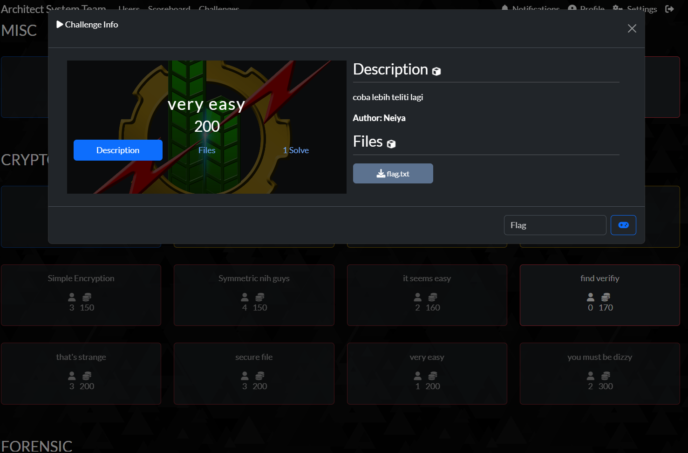
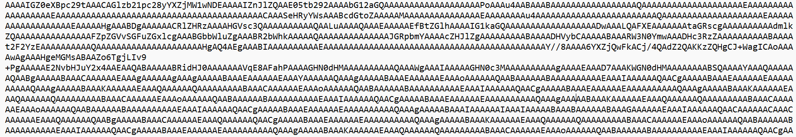
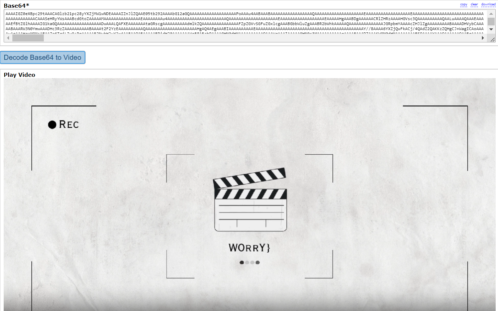

## Attached
### Very Easy

kita di suruh untuk mendownload file yang berformat kan txt, soal ada [Di sini.](https://ctf.bayu18.my.id/challenges#very%20easy-40)

## Solutions
setelah kita baerhasil mendownload file tersebut, kita mencoba untuk membuka file itu. dan kurang lebih isi nya seperti ini

isi dari file tersebut ternyata sudah di encode menggunakan base64

kita tau itu base64 karena Base64 terdiri dari karakter-karakter ASCII yang umum, termasuk huruf besar, huruf kecil, angka, dan beberapa simbol khusus seperti + dan /

karena teks itu sangat panjan ada kemungkinan itu adalah metadata yang di encode dengan base64

jadi kita coba untuk mengubah file itu menjadi sebuah foto/video, kita menggunakan tools dari website <https://base64.guru/converter/decode/video>

dan ternyata itu adalah video yang berisikan flag

#### FLAG : W92{TH1S_1S_A_G4M3_D0NT_W0RRY}
