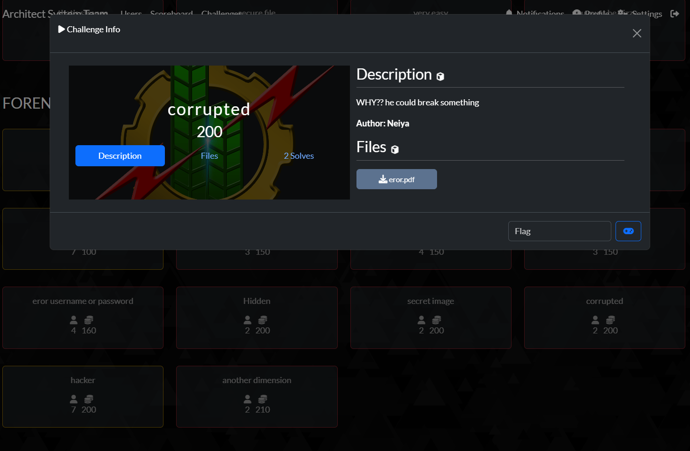
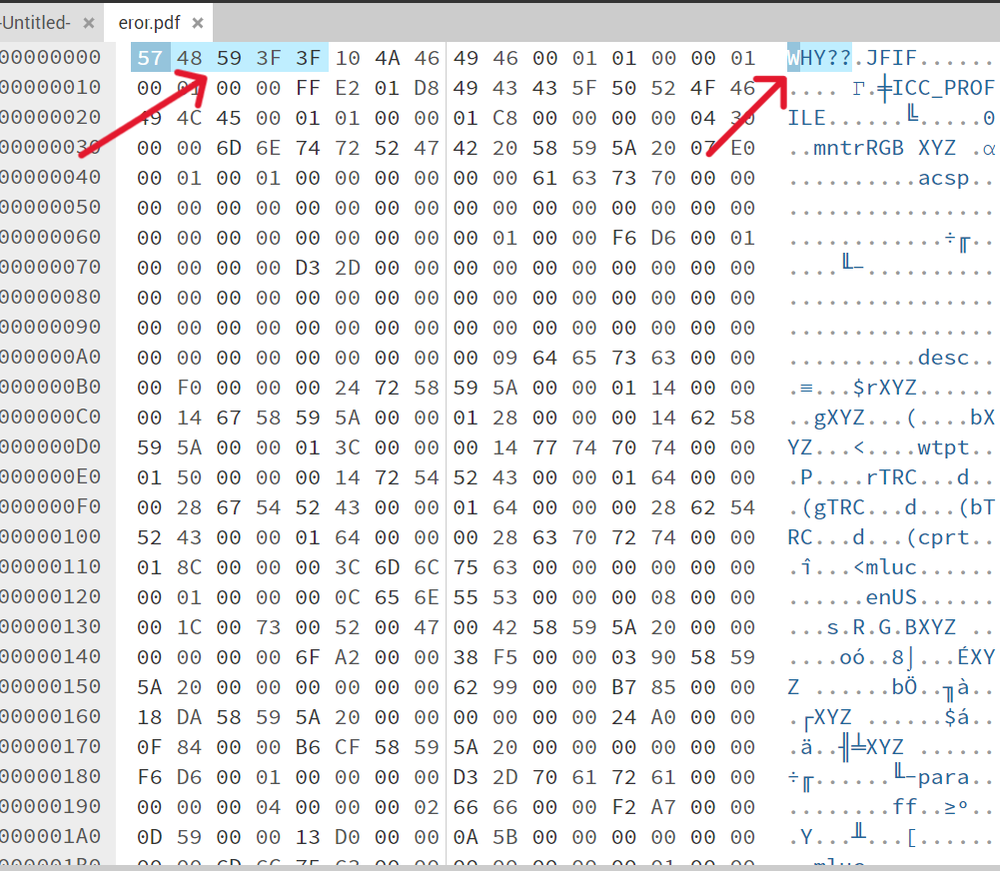
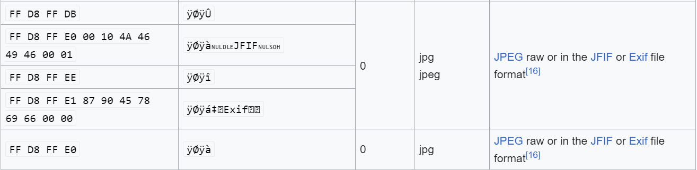
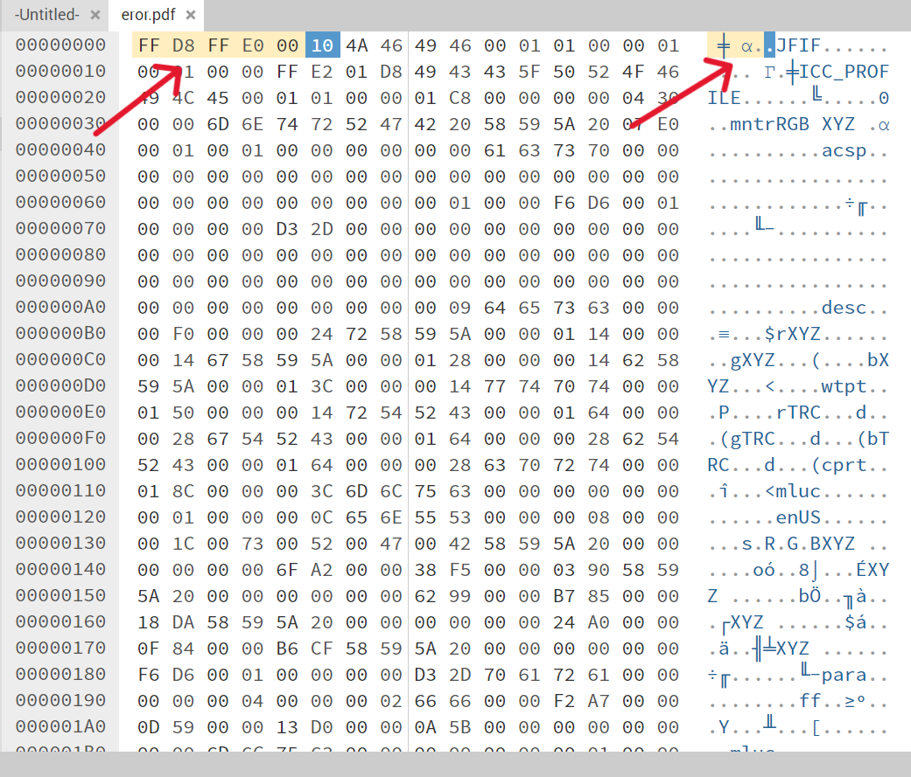

## Attached
### Corrupted

kita di suruh untuk mendownload file yang berformat kan pdf, soal ada [Di sini](https://ctf.bayu18.my.id/challenges#corrupted-38)

## solutions

kita akan melihat metadata nya terlebih dahulu di website <https://hexed.it/>

dan disini kita menemukan bahwa ada meta data yang tidak sesuai dengan file aslinya yaitu JFIF, JFIF adalah signature file JPG/JPEG.

kita mencoba untuk melihat signature file nya [di sini](https://en.wikipedia.org/wiki/List_of_file_signatures) dan kita mencari signature file JFIF

di situ kita dapat melihat hex signature JFIF adalah

***FF D8 FF E0 00***

kita coba untuk menganti file yang kita download dengan signature hex tersebut

dan mengganti format dari yang sebelum nya **pdf** menjadi **jpeg**

dan saat kita buka di situ ternyata ada flag nya yaitu

**FLAG : 
W92{coruppt2on_im4ge_because_WHAT??hhh!!!}**