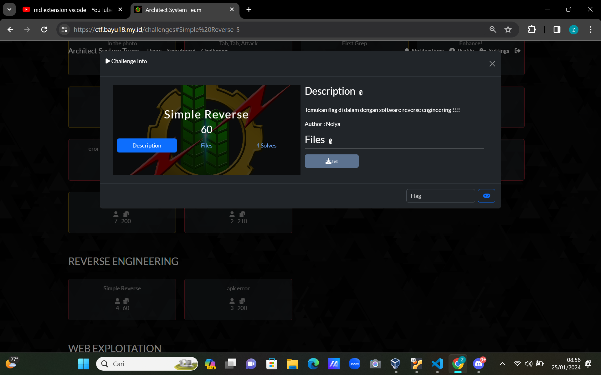
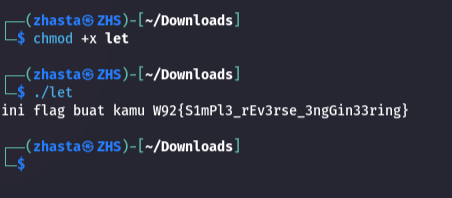

## Attached
kita di berikan sebuah soal seperti gambar di bawah ini

soal bisa kalian download [di sini](https://ctf.bayu18.my.id/challenges#Simple%20Reverse-5)

## Solutions

kita download dulu soal yang tadi dan pergi ke terminal Linux nya

kita mencoba untuk memberikan permission pada file tersebut dengan
```plaintext
$chmod +x let
```
dan kita mencoba untuk menjalankan file tersebut dengan perintah 
```plaintext
$./let
```


sangat mudah sekali jir

### flag : W92{S1mPl3_rEv3rse_3ngGin33ring}
